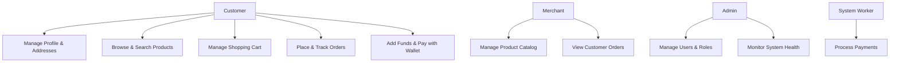
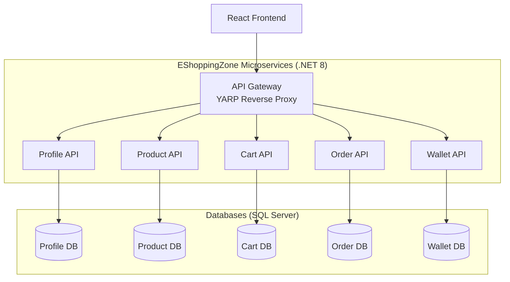
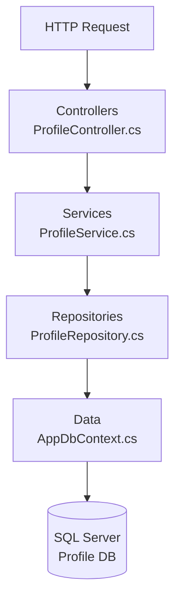
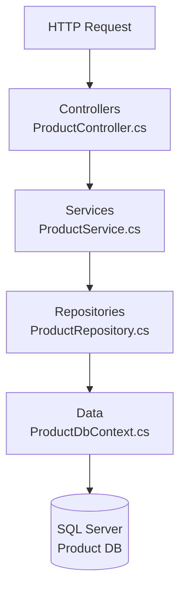
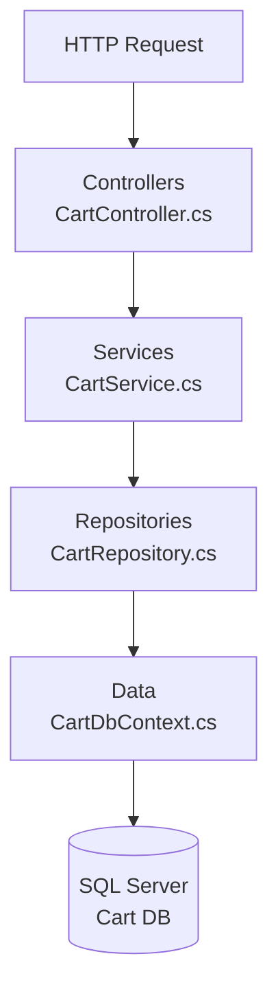
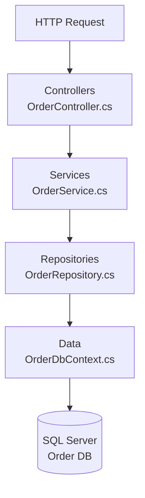
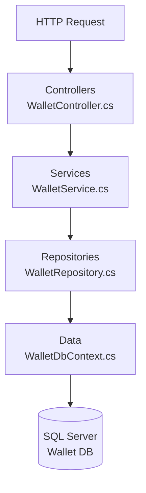
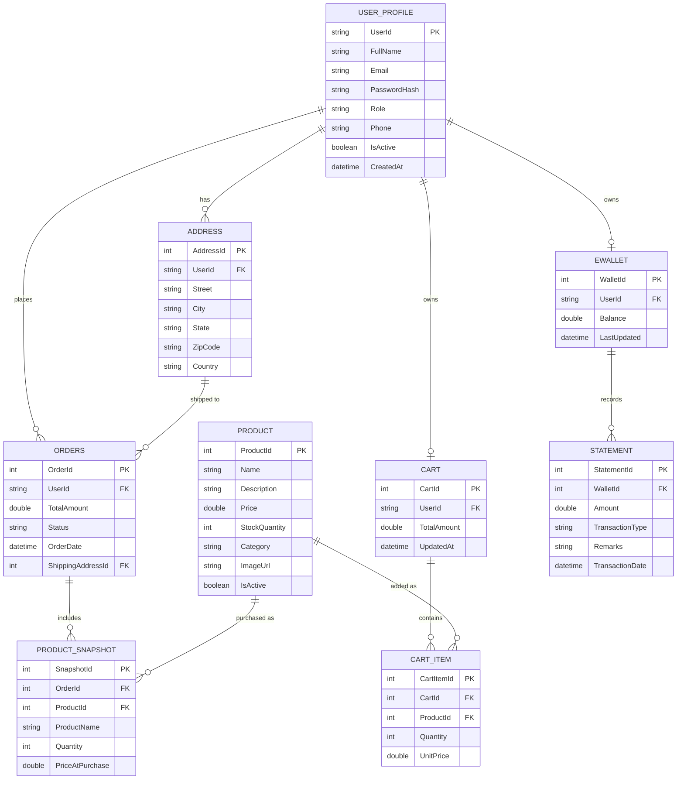
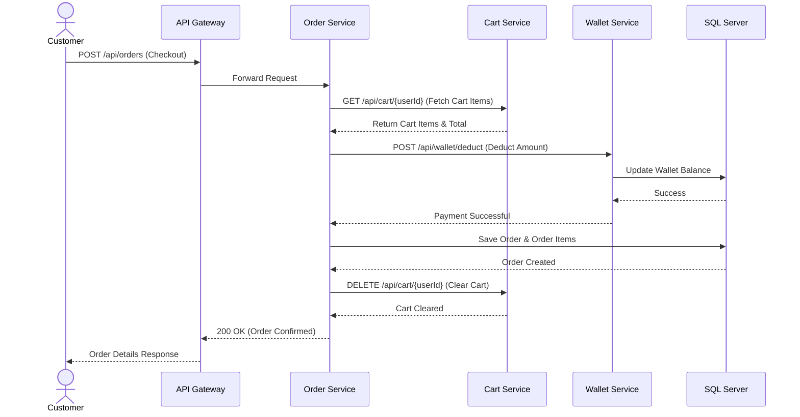
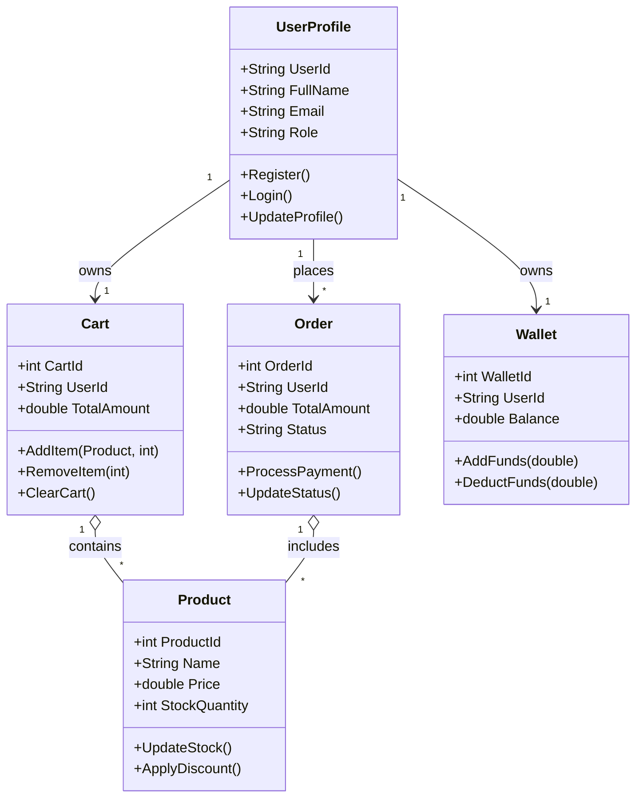

# EShoppingZone Backend Microservices

A scalable microservices-based backend for the **EShoppingZone E-Commerce Platform**, built with **.NET 8, ASP.NET Core Web API, Entity Framework Core, SQL Server, JWT Authentication, and Docker**.

This backend powers customer shopping, merchant product management, order processing, wallet payments, authentication, and administrative operations.

---

## System Use Case Diagram

The following diagram outlines the overarching use cases across the EShoppingZone platform, mapping system actors (Customer, Merchant, Admin) to their respective capabilities.



---

## Microservices Architecture & Connectivity



Each service follows a consistent layered structure:

```
ServiceName/
├── Controllers/      # HTTP endpoints
├── Services/         # Business logic
├── Repositories/     # Data access layer
├── Entities/         # EF Core models
├── DTOs/             # Request / response models
├── Data/             # DbContext
├── Middlewares/      # Global exception handling
└── Migrations/       # EF Core migrations
```

---

## Microservice Internal Workflows (File-to-File Flow)

The following diagrams illustrate the internal execution flow of files within each microservice when an API request is received. The architecture follows a strict Controller -> Service -> Repository -> Database pattern to ensure separation of concerns.

### 1. Profile Service Flow


### 2. Product Service Flow


### 3. Cart Service Flow


### 4. Order Service Flow


### 5. Wallet Service Flow


---

## Data Architecture (ER Diagram)

This section provides a logical Entity-Relationship (ER) diagram for the EShoppingZone system.



---

## Low-Level Design (LLD) - Checkout Workflow

The following sequence diagram illustrates the low-level interactions between the microservices when a customer places an order.



---

## UML Class Diagram (Domain Models)

The following UML class diagram represents the core structural relationships and behaviors within the backend domains.



---

## Services

| Service | Responsibility |
|---|---|
| **API Gateway** | Single entry point, routes all requests via YARP Reverse Proxy |
| **Profile Service** | User authentication, JWT token issuance, profile & address management |
| **Product Service** | Product catalog CRUD, inventory tracking |
| **Cart Service** | Shopping cart operations, adding/removing items |
| **Order Service** | Checkout process, order lifecycle and status tracking |
| **Wallet Service** | Digital wallet management, fund additions, payment statements |

---

## Tech Stack

- **Runtime**: .NET 8 / ASP.NET Core Web API
- **ORM**: Entity Framework Core 8
- **Database**: SQL Server
- **API Gateway**: YARP Reverse Proxy
- **Authentication**: JWT + GitHub OAuth
- **Inter-Service Communication**: IHttpClientFactory
- **Logging**: Serilog
- **Containerization**: Docker
- **Orchestration**: Docker Compose / Kubernetes
- **CI/CD**: GitHub Actions

---

## Testing

Each service has a corresponding test project using xUnit and Moq (e.g., `ProfileService.Tests`, `ProductService.Tests`).

Run all tests from the solution root:

```bash
dotnet test
```

---

## Project Structure

```
EShoppingZone-Backend/
├── backend/
│   ├── ApiGateway/
│   ├── CartService/
│   ├── CartService.Tests/
│   ├── OrderService/
│   ├── OrderService.Tests/
│   ├── ProductService/
│   ├── ProductService.Tests/
│   ├── ProfileService/
│   ├── ProfileService.Tests/
│   ├── WalletService/
│   └── WalletService.Tests/
└── EShoppingZone-Backend.sln
```
