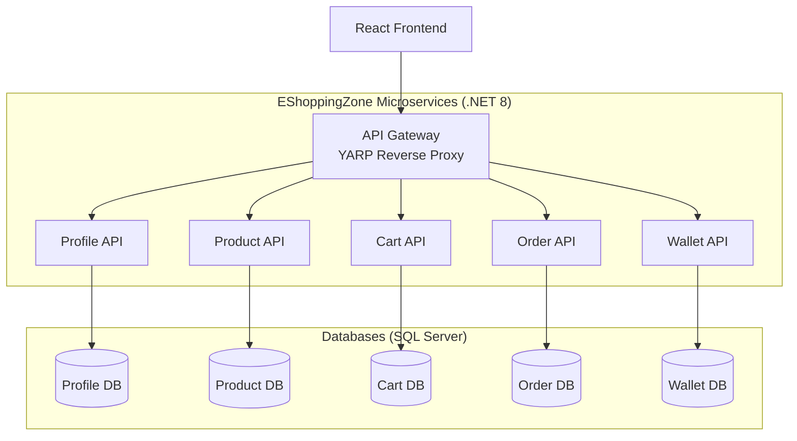

# EShoppingZone Backend Microservices

A scalable microservices-based backend for the **EShoppingZone E-Commerce Platform**, built with **.NET 8, ASP.NET Core Web API, Entity Framework Core, SQL Server, JWT Authentication, and Docker**.

This backend powers customer shopping, merchant product management, order processing, wallet payments, authentication, and administrative operations.

---

# Architecture Overview

The backend follows a **microservices architecture**, where each service owns its business domain, database context, and API endpoints.

## Microservices

- **Profile Service** → User authentication, profiles, roles, addresses
- **Product Service** → Product catalog management
- **Cart Service** → Shopping cart operations
- **Order Service** → Checkout, orders, status tracking
- **Wallet Service** → Digital wallet and transactions
- **API Gateway** → Unified entry point for all backend services

---

# Tech Stack

| Layer | Technology |
|------|------------|
| Framework | .NET 8 |
| API | ASP.NET Core Web API |
| ORM | Entity Framework Core 8 |
| Database | SQL Server |
| Authentication | JWT + GitHub OAuth |
| API Gateway | YARP Reverse Proxy |
| Inter-Service Communication | IHttpClientFactory |
| Logging | Serilog |
| Containerization | Docker |
| Orchestration | Docker Compose / Kubernetes |
| CI/CD | GitHub Actions |

---

# High-Level Architecture

